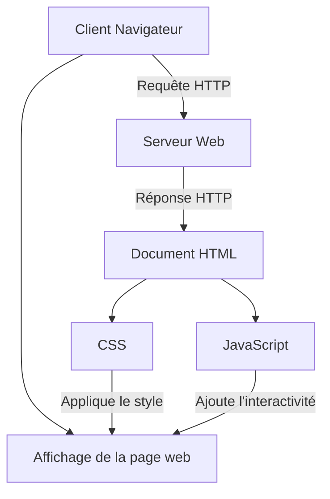

# test fork mkdocs-material

## Getting started

1. cloner ce dépôt
2. construire l'image (ça prend un moment ya chromium dedans)  
   `docker build -t squidfunk/mkdocs-material .`
3. lancer le serveur de dev dans le container  
   `docker run --rm -it -p 8000:8000 -v ${PWD}:/docs squidfunk/mkdocs-material`

