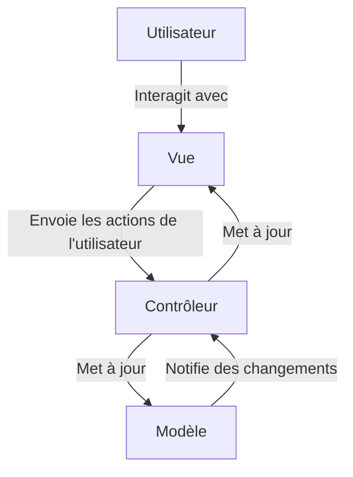
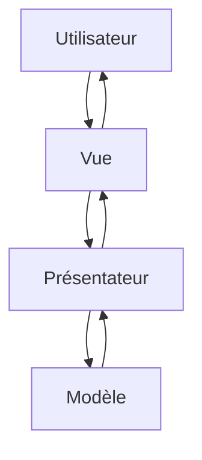
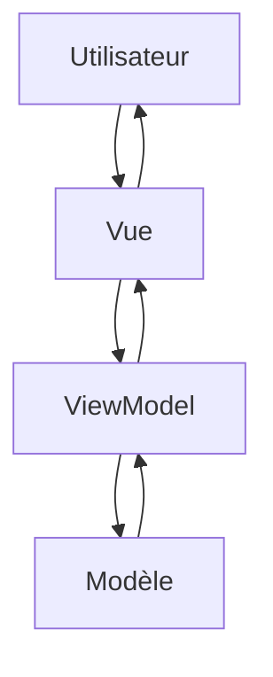
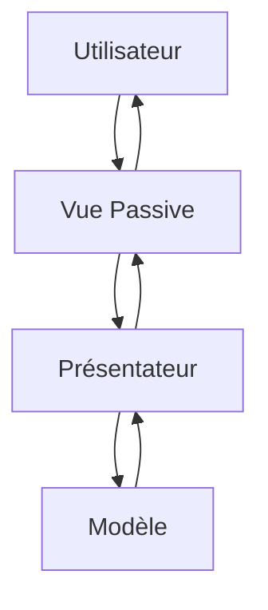
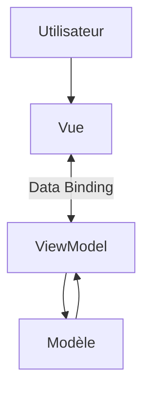
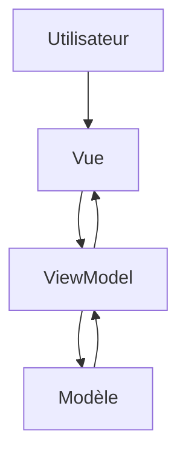
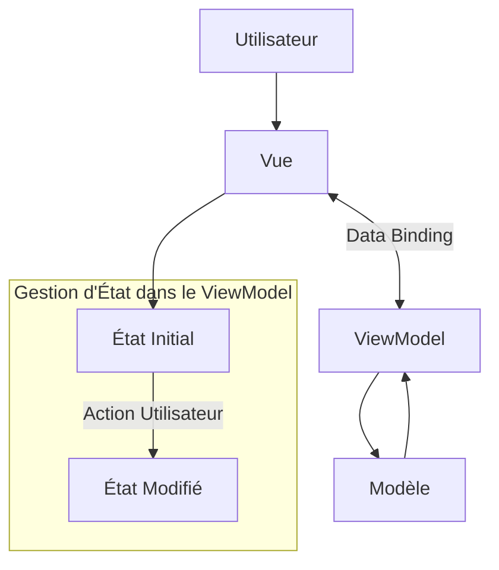

# Modèle Vue Contrôlleur

## Diagramme pour MVC (Model-View-Controller)

Explication :

 * L'utilisateur interagit avec la Vue.
 * La Vue envoie des actions au Contrôleur.
 * Le Contrôleur modifie l'état du Modèle.
 * Le Modèle met à jour la Vue.
 * La Vue renvoie les informations à l'utilisateur.

## Diagramme pour MVP (Model-View-Presenter)

Explication :

 * L'utilisateur interagit avec la Vue.
 * La Vue envoie les événements au Présentateur.
 * Le Présentateur interagit avec le Modèle et traite la logique métier.
 * Le Modèle renvoie des données au Présentateur.
 * Le Présentateur met à jour la Vue, qui les affiche à l'utilisateur.

## Diagramme pour MVVM (Model-View-ViewModel)

Explication :

 * L'utilisateur interagit avec la Vue.
 * La Vue se lie automatiquement au ViewModel.
 * Le ViewModel sert d'intermédiaire entre la Vue et le Modèle, contenant la logique de présentation.
 * Le Modèle est mis à jour par le ViewModel et renvoie les données à celui-ci.
 * Le ViewModel met à jour la Vue, sans intervention directe du contrôleur.

## Diagramme pour MVP (Passive View)

Explication :

 * Dans cette variante, la Vue Passive ne contient aucune logique de présentation.
 * Le Présentateur est totalement responsable de la logique de la vue et de l'interaction avec le Modèle.

## Diagramme pour MVVM (Data Binding)

Explication :

 * Le Data Binding relie automatiquement la Vue et le ViewModel.
 * Les modifications dans le Modèle via le ViewModel sont immédiatement reflétées dans la Vue, et vice versa.

### MVVM avec Data Binding Automatique (One-Way Binding)

Explication :

 * L'utilisateur interagit avec la Vue.
 * La Vue se lie au ViewModel grâce au data binding en One-Way (unidirectionnel), c'est-à-dire que les données du ViewModel mettent à jour la Vue automatiquement.
 * Le ViewModel récupère les données du Modèle.
 * Le Modèle est responsable de la gestion des données, et toute modification est reflétée dans le ViewModel, qui met ensuite à jour la Vue.

### MVVM avec Data Binding Bidirectionnel (Two-Way Binding)

Explication :

 * L'utilisateur interagit avec la Vue.
 * Dans le data binding bidirectionnel, la Vue et le ViewModel se synchronisent automatiquement.
   * Les modifications de l'utilisateur dans la Vue mettent à jour le ViewModel.
   * Les modifications dans le ViewModel mettent à jour la Vue.
 *  Le ViewModel communique avec le Modèle pour obtenir ou modifier les données.
 * Le Modèle transmet les données au ViewModel, qui met à jour la Vue en conséquence.

###  MVVM avec Gestion d’État dans le ViewModel

TODO: vérif

Explication :

 * Le ViewModel gère l'état de l'application, par exemple, l'état initial (vue de chargement) et l'état modifié (données affichées).
 * L'utilisateur interagit avec la Vue, déclenchant une action.
 * Le ViewModel change d'état (de C1 : État Initial à C2 : État Modifié).
 * Le data binding synchronise automatiquement l'état entre la Vue et le ViewModel.

